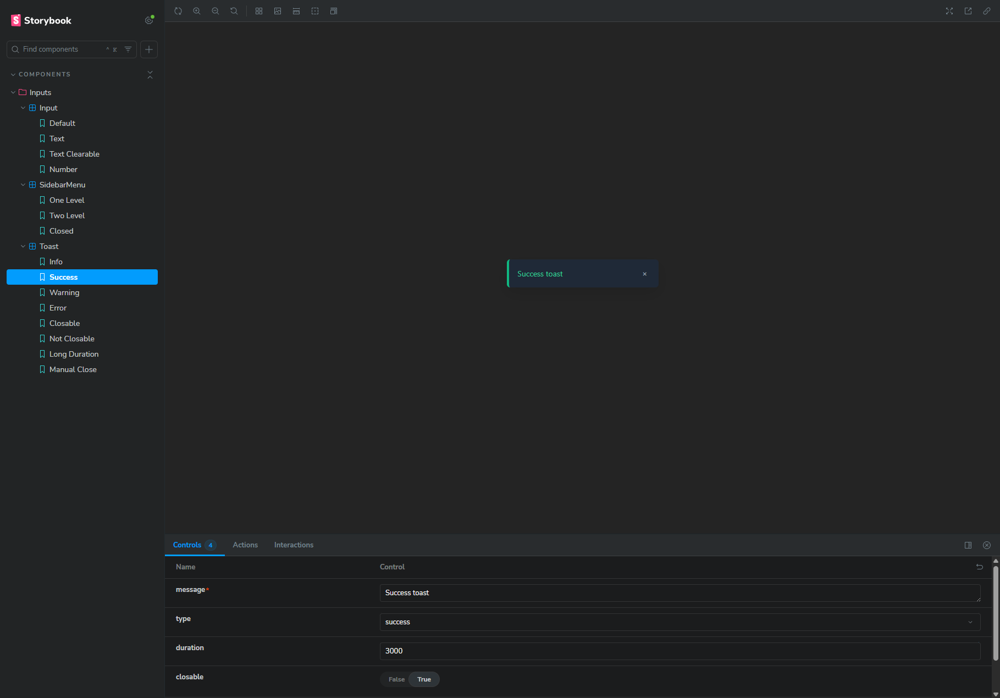

### DT-TEST-ASSESSMENT

#### Install

```bash
git clone https://github.com/WilfredoN/dt-test-assessment
cd dt-test-assessment
npm i
npm run storybook
```

#### Screenshots

<table>
    <tr>
        <td><strong>Input Example 1</strong><br></td>
        <td><strong>Input Example 2</strong><br></td>
    </tr>
    <tr>
        <td><strong>Sidebar Example 1</strong><br></td>
        <td><strong>Sidebar Example 2</strong><br></td>
    </tr>
    <tr>
        <td><strong>Toast Example 1</strong><br></td>
        <td><strong>Toast Example 2</strong><br></td>
    </tr>
</table>
